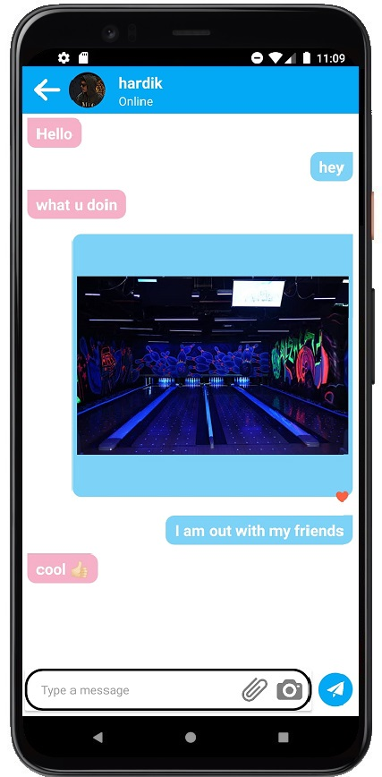
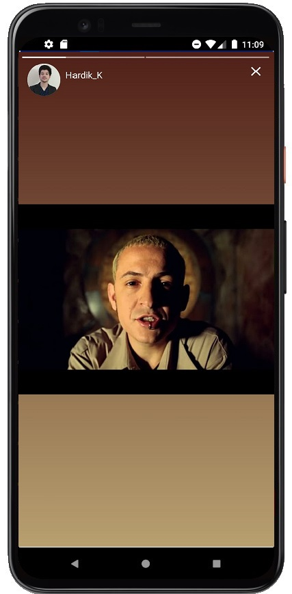
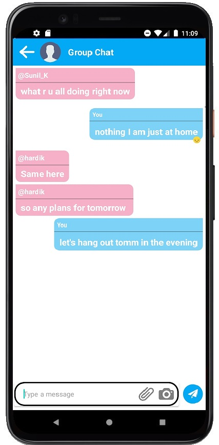

# TechyTalk
### In this Lockdown when all communication is happening through internet  
### hence this user - friendly Techy-Talk allows you to chat with your friends  
### and is integrated with Firebase

App Screens
-------
| SignUp Page       |     Home Screen      | 
| ------------- | -----:|
|      |  | 

| Chat Page        | Status Viewer          | 
| ------------- | -----:|
|     |  |

| Group Chat Page        | 
| ------------- |
|     |

## Key Features
* You can send 2 millions chat everyday for free
* You can send images and videos in your chats
* You can watch others stories and can add emotions to messages just like instagram
* There is also feature for group chat

